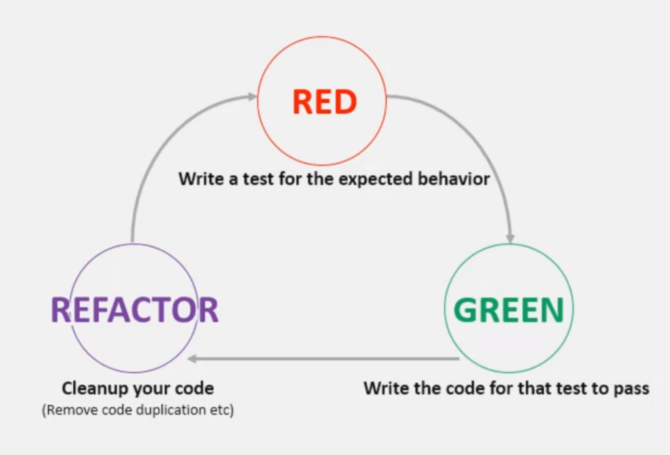

# Introduction

- [Introduction](#introduction)
  - [Methodology](#methodology)
  - [creating the project](#creating-the-project)
  - [entry point to the application](#entry-point-to-the-application)
    - [output](#output)
    - [Test Runner](#test-runner)
    - [let's add super test](#lets-add-super-test)
  - [Development Dependencies](#development-dependencies)
    - [eslint](#eslint)
    - [config file](#config-file)

## Methodology



## creating the project

```shell
npm init
```

answer the questions

```json
{
  "name": "express-ws",
  "version": "1.0.0",
  "description": "TDD with express",
  "main": "app.js",
  "scripts": {
    "test": "echo \"Error: no test specified\" && exit 1"
  },
  "author": "chamara weerasinghe",
  "license": "ISC"
}
```

## entry point to the application

create a file called app.js

```js
const express = require('express');

const app = express();

app.listen(3000, () => {
  console.log('App is running....');
});
```

to run the app

```shell
node app.js
```

but we are not returning anything

let's add the start script to the package.json

```json
 "scripts": {
    "test": "echo \"Error: no test specified\" && exit 1",
    "start": "node app.js"
  },
```

### output

```shell
App is running....
```

### Test Runner

let's add a test runner
will install jest

```shell
npm install --save-dev jest
```

let's see the package.json file

```json
 "devDependencies": {
    "jest": "^28.1.3"
  }
```

let's add a test running script

```json
 "scripts": {
    "test": "jest --watch"
  }
```

output

```shell
No tests found related to files changed since last commit
```

### let's add super test

```shell
npm install --save-dev supertest
```

## Development Dependencies

### eslint

```shell
npm install --save-dev eslint
```

or short form

```shell
npm i -D eslint
```

[eslint website](https://eslint.org/docs/latest/user-guide/getting-started)

### config file

and add the eslint config file

```json
  "eslintConfig": {
    "parserOptions": {
      "ecmaVersion": 6
    },
    "extends": [
      "eslint:recommended"
    ],
    "env": {
      "node": true,
      "es6": true,
      "jest": true
    },
    "rules": {
      "semi": [
        "error",
        "always"
      ],
      "quotes": [
        "error",
        "single"
      ]
    }
  }
```
